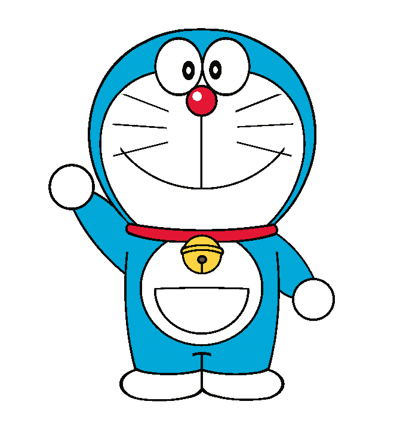
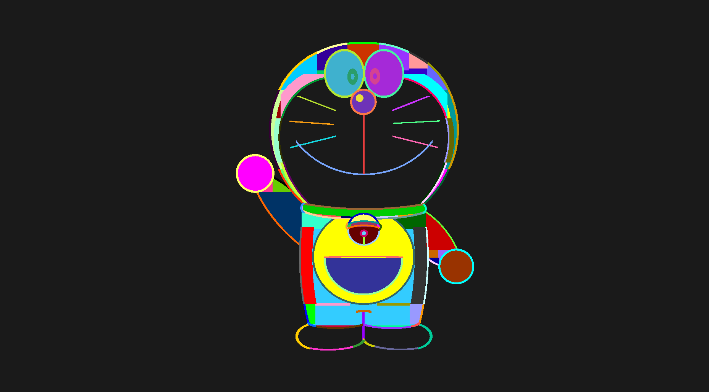

 

# Doraemon

*Doraemon, built with pure HTML and CSS.*

> [!IMPORTANT]
> You will probably run into some sub-pixel rendering issues. Don't worry, it's a common quirk of this art style.

> [!IMPORTANT]
> Firefox users may see duplicate gradient artifacts at viewport widths below 500px due to a Firefox rendering bug.
>
> I reported this issue to Mozilla in [Bug 2057205](https://bugzilla.mozilla.org/show_bug.cgi?id=2057205), and it has since been fixed. The fix is available in the lastest Firefox versions.

## Design
The line art and the colouring are rendered entirely through exploiting CSS gradients (**94 in total**) on a single div. No SVGs, pseudo-elements, or external assets are used.

To demonstrate the scale of the layering, the image below shows the result of replacing every colour (except transparent) with a unique random hex code:

## Inspirations
- **Senjougahara Hitagi** by Gagah Pangeran Rosfatiputra: <https://github.com/gagahpangeran/hitagi-css>
- **Homer Simpson** by Alvaro Montoro: <https://dev.to/alvaromontoro/homer-simpson-in-css-with-a-single-html-element-4ood>

## License
The code in this repository is licensed under MIT-0. See [license.txt](./license.txt).

This project is a personal, non-commercial CSS art experiment and is not affiliated with or endorsed by the owners of the [Doraemon](https://dora-world.com/) intellectual property. Doraemon is a trademark and copyright of [Fujiko Pro](http://www.fujio-pro.co.jp/english/), [Shin-Ei Animation](https://www.shin-ei-animation.jp/), and [TV Asahi](https://www.tv-asahi.co.jp/doraemon/).

The design is based on [Shutterstock AI Asset #2718900541](https://www.shutterstock.com/image-generated/doraemon-2718900541). 
